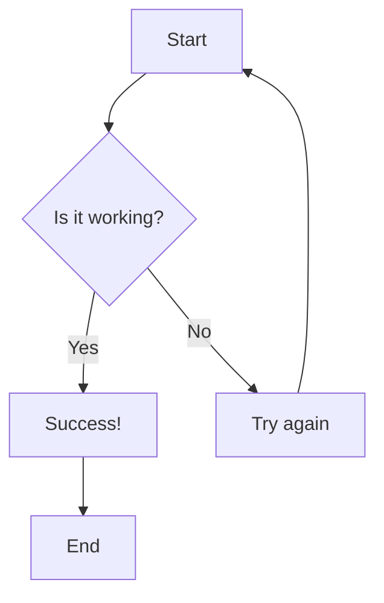

# CicarusBank
Projeto de microsserviços simulando um banco

# To do
  - Eureka Server
    - Client (em cada micro e fazer apontar pro server)
    - Server (subir no docker)
  - Comunicacao entre os micros por HTTP
    - Fazer o Filtro pro JWT em cada micro e determinar qual funcao vai ser USER/ADMIN
  - API Gateway
    - Fazer o tratamento dos endpoints de cada Client pelo Servidor
  - Adicionar mais micros
  - Front-end (BOMBA)

# Para roda bancos + eureka no docker
- navegar para CicarusBank/naming-server
- rodar ``./mvnw clean package``
- voltar para a raiz do projeto com ``cd ..`` 
- navegar para CicarusBank/api-gateway
- rodar ``./mvnw clean package``
- voltar para a raiz do projeto com ``cd ..``
- rodar ``docker-compose up --build -d``
- verificar usando ``docker compose ps``

## Simple Test Diagram

