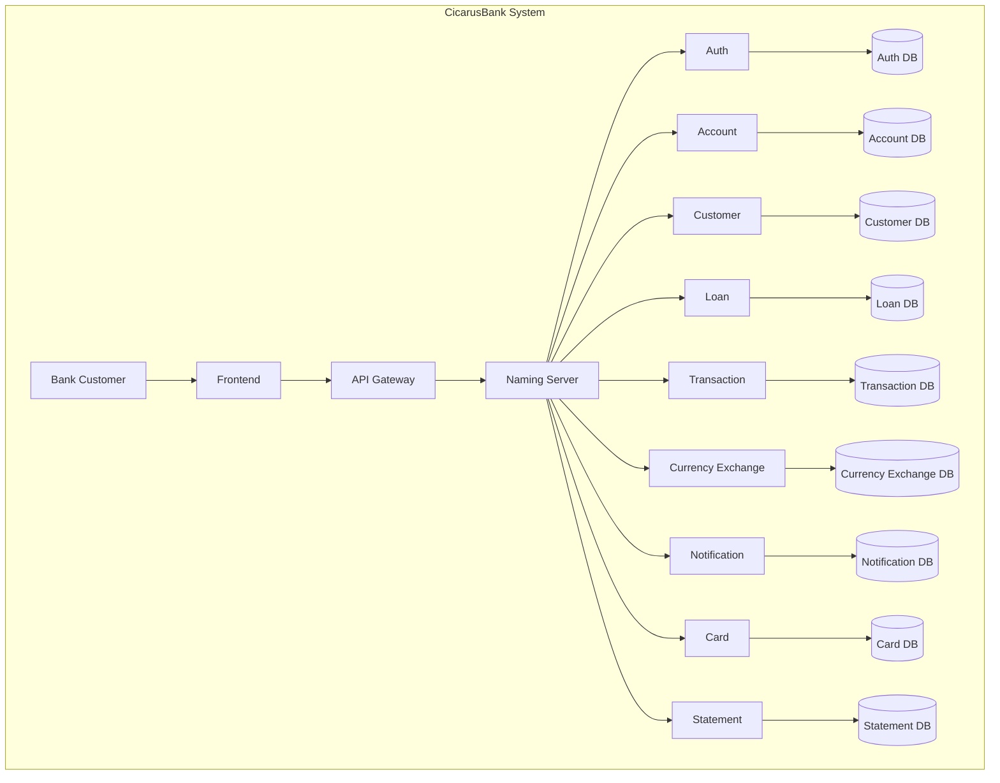

# CicarusBank

## About CicarusBank
CicarusBank is a collaborative project that implements a comprehensive banking system. It is designed and developed 
using a  microservices architecture.

## Tech Stack
This project utilizes the following key technologies:

*   **Frontend:** React
*   **Backend:** Spring Boot
*   **Containerization:** Docker
*   **Database:** MySQL


## How to Run

To run the CicarusBank application, follow these steps:

### Prerequisites
Before you begin, ensure you have the following installed:
*   **Docker** and **Docker Compose**: For containerizing and orchestrating the microservices.
*   **Maven**: For building the Spring Boot microservices.

### Running the Application

1.  **Navigate to the project root:**
    ```bash
    cd .../CicarusBank
    ```

2.  **Execute the `runapp.sh` script:**
    This script automates the process of building the microservices and starting the Docker containers.
    ```bash
    ./runapp.sh
    ```

    The script performs the following actions:
    *   Shuts down any currently running Docker containers for the project.
    *   Runs `mvnw clean package` to clean and package all Maven-based microservices.
    *   Builds and starts all services using `docker compose up --build -d` in detached mode.

3.  **Verify containers (Optional):**
    You can check the status of your running containers using:
    ```bash
    docker compose ps
    ```

## System Architecture Diagram

docker-compose up mysql-auth mysql-customer mysql-emailModel mysql-statement mysql-currency mysql-account mysql-transaction mysql-loan mysql-card --build -d
